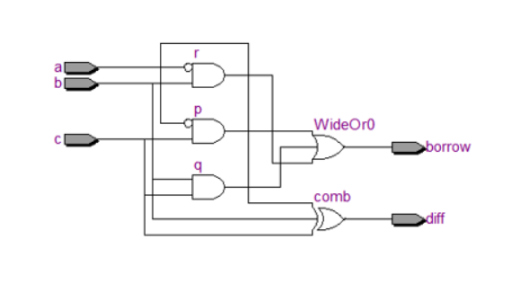

### Ex. No. 4
### Date: 28.4.23
# Implementation of half subtractor and full subtractor circuit using Verilog HDL
## Aim :
To design and implement half subtractor and full subtractor circuit and verify its truth table.
## Components Required:
1.	Laptop with Quartus software and modelsim software.
## Theory:
Subtractor circuits take two binary numbers as input and subtract one binary number input from the other binary number input. Similar to adders, it gives out two outputs, difference and borrow (carry-in the case of Adder). There are two types of subtractors.

1) Half Subtractor
2) Full Subtractor
### 1.	Half Subtractor
The half-subtractor is a combinational circuit which is used to perform subtraction of two bits. It has two inputs, X (minuend) and Y (subtrahend) and two outputs D (difference) and B (borrow). To perform x - y, we have to check the relative magnitudes of x and y. If x ;;, y, we have three possibilities: 0 - 0 = 0, 1 - 0 = 1, and 1 - I = 0. The result is called the difference bit. If x < y, we have 0 - I, and it is necessary to borrow a 1 from the next higher stage. The I borrowed from the next higher stage adds 2 to the minuend bit, just as in the decimal system a borrow adds 10 to a minuend digit. With the minuend equal to 2, the difference becomes 2 - I = 1. The half-subtractor needs two outputs. One output generates the difference
and will be designated by the symbol D. The second output, designated B for borrow, generates the binary signal that informs the next stage that a I has been borrowed.
#### Truth table
 

Sum = X’Y+XY’ = X 
 Y  
Carry=X’Y
#### Logic Diagram

 
### 2.	Full Subtractor
A full subtractor is a combinational circuit that performs subtraction involving three bits, namely minuend, subtrahend, and borrow-in . It accepts three inputs: minuend, subtrahend and a borrow bit and it produces two outputs: difference and borrow. 

#### Truth table
  .

 
#### Logic Diagram
 

## Procedure:
1.	Type the program in Quartus software.
2.	Compile and run the program.
3.	Generate the RTL schematic and save the logic diagram.
4.	Create nodes for inputs and outputs to generate the timing diagram.
5.	For different input combinations, generate the timing diagram.

## Program:
### HALF SUBTRACTOR:
module exp4a(a,b,diff,borrow); 
input a,b; 
output diff,borrow; 
wire adash; 
xor(diff,a,b); 
not(adash,a); 
and(borrow,adash,b); 
endmodule 
### FULL SUBTRACTOR:
module exp4b(a,b,c,diff,borrow); 
input a,b,c; 
output diff,borrow; 
wire adash,x,p,q,r; 
xor(x,b,c); 
xor(diff,a,x); 
not(adash,a); 
and(p,adash,c); 
and(q,b,c); 
and(r,adash,b); 
or(borrow,p,q,r); 
endmodule
## RTL Schematic:
HALF SUBTRACTOR: 
 
FULL SUBTRACTOR:

## Timing Diagram:
 

## Result:
Thus the half subtractor and full subtractor circuits are designed and the truth tables are verified using Verilog HDL.
